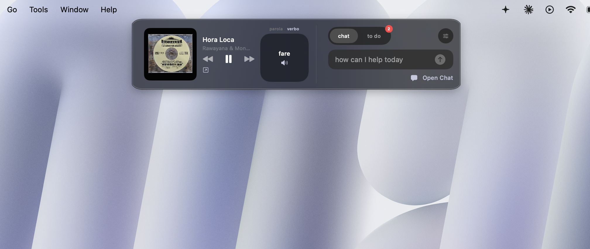
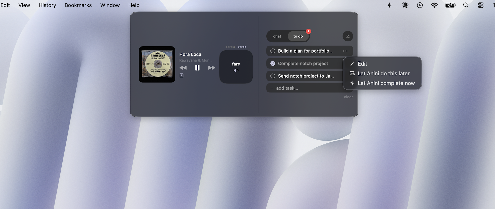
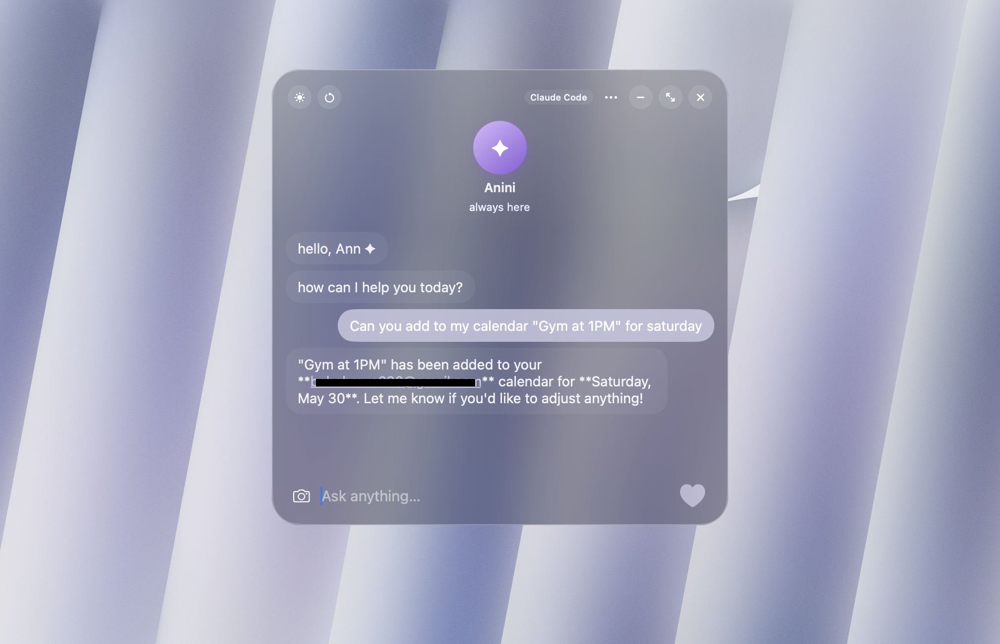
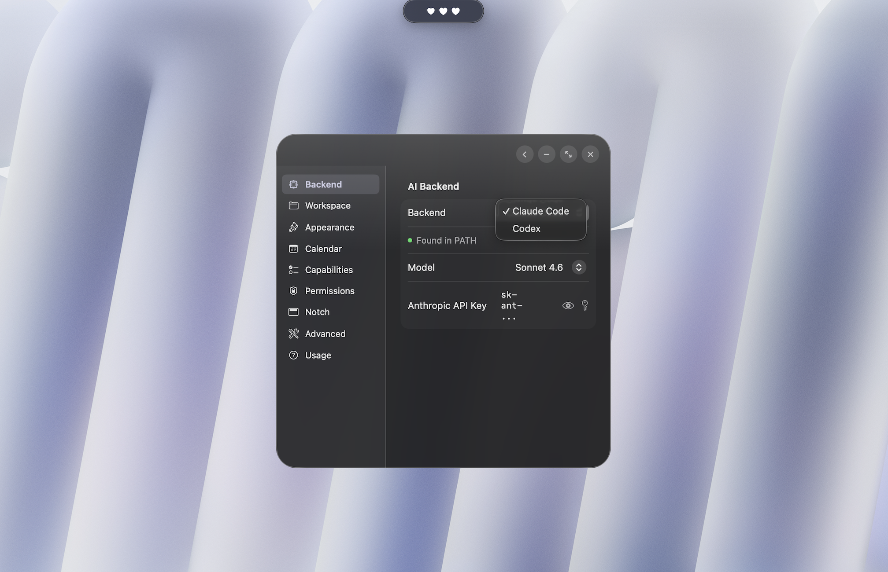
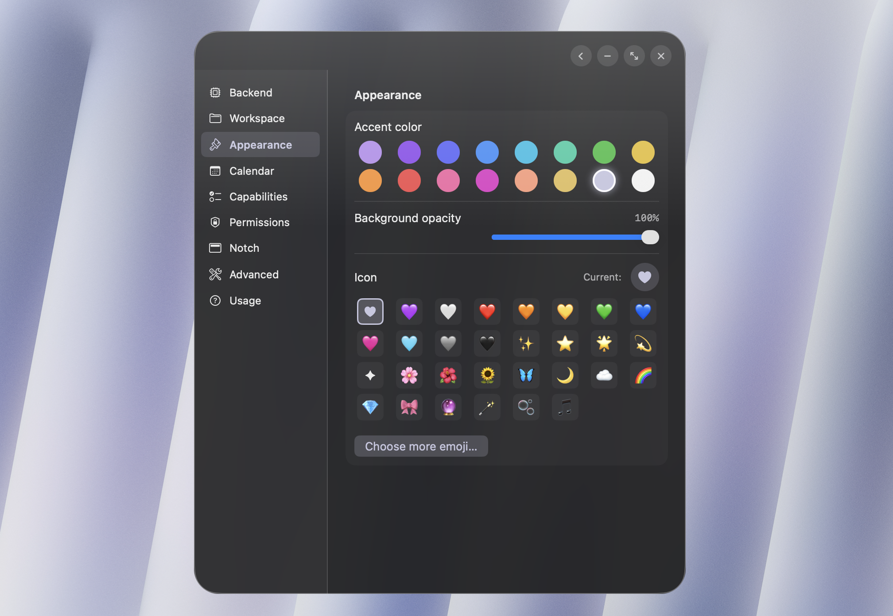
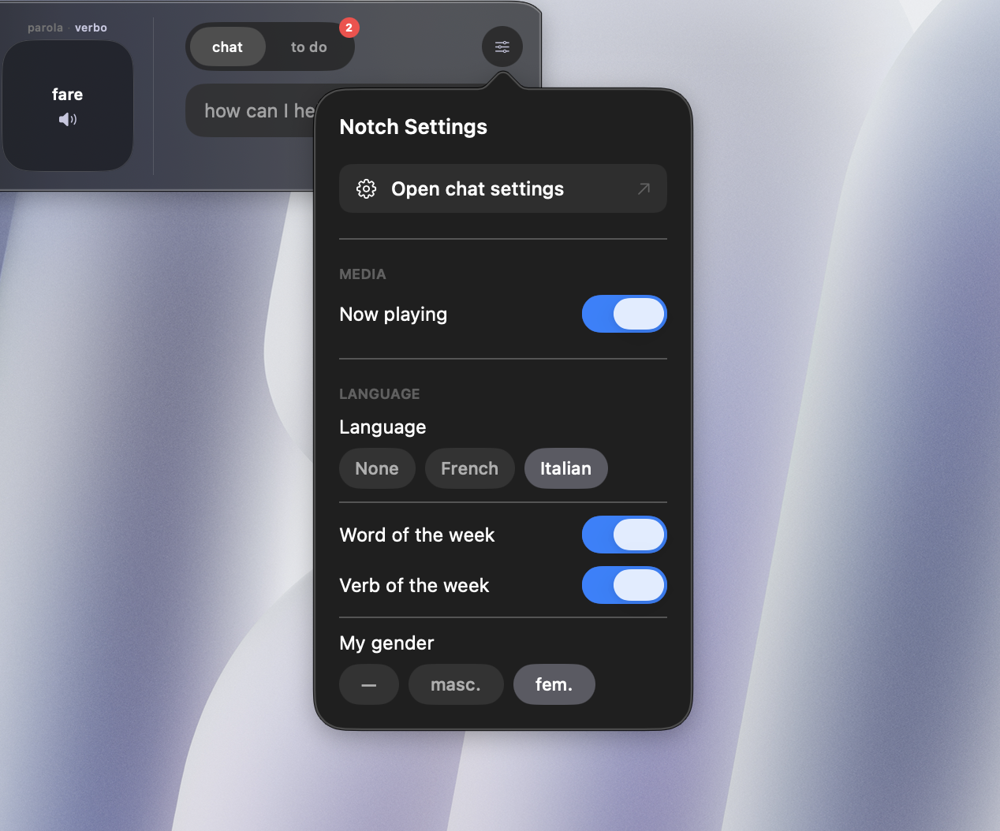
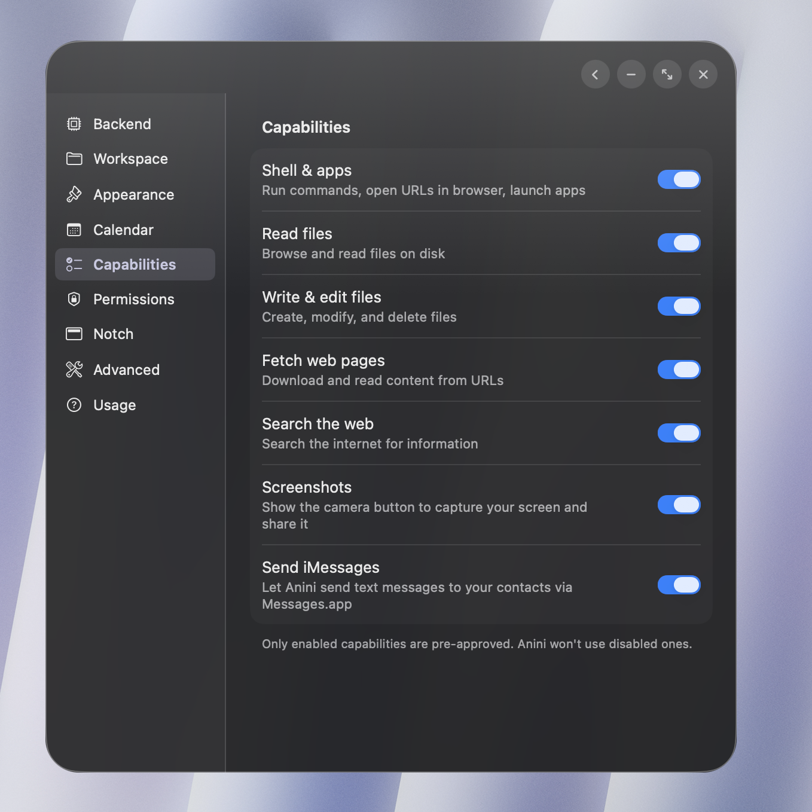

# Anini ✦

A floating, always-available AI assistant for macOS — built in native SwiftUI.

- **⌥Space** anywhere to summon. Type a question, get an answer.
- Lives in your menu bar as a sparkle (✦), with a notch widget for to-dos, now playing, and language practice.
- Backed by **Claude Code** (default) or **OpenAI Codex** — pick in Settings.
- Full Mac control: shell, AppleScript, Apple Music, iMessage, Calendar, Contacts, screenshots, and more.
- API keys live in your macOS Keychain. No cloud, no relay.

---

## Screenshots

| Light | Dark |
|---|---|
|  |  |

**Notch widget** — now playing, chat, and to-dos:



**To-do actions** — let Anini do it later, or complete it now:



**Calendar demo** — Anini adding a Google Calendar event from chat:



---

## Requirements

Before you build, you'll need:

| Tool | Why | How to get it |
|---|---|---|
| macOS 26 (Tahoe) or later | Deployment target | System Settings → Software Update |
| Xcode 16+ | Build the app | Mac App Store |
| Node.js | The Claude/Codex CLIs run on Node | [nodejs.org](https://nodejs.org) |
| Homebrew | Install xcodegen | [brew.sh](https://brew.sh) |
| xcodegen | Generates `Anini.xcodeproj` from `project.yml` | `brew install xcodegen` |
| Claude Code CLI *or* Codex CLI | The AI brain Anini talks to | See [Pick a backend](#pick-a-backend) below |
| An API key | For whichever backend you pick | [console.anthropic.com](https://console.anthropic.com) (Claude) or [platform.openai.com](https://platform.openai.com) (Codex) |

---

## Install (one-time setup)

### 1. Clone

```bash
git clone <this-repo-url> ~/Projects/Anini
cd ~/Projects/Anini
```

### 2. Set up code signing

This creates a stable self-signed certificate in your Keychain so macOS permissions
(Screen Recording, iMessage, etc.) don't break every time you rebuild Anini.

```bash
./scripts/setup-signing.sh
```

macOS will ask for your Mac login password once. The cert lives only on your Mac.

### 3. Generate the Xcode project

```bash
xcodegen generate
```

### 4. Build in Xcode

```bash
open Anini.xcodeproj
```

In Xcode: press **`Cmd+B`** to build. **Do NOT press `Cmd+R`** — Xcode's debug-dylib
feature will fight with the signing setup and crash the app.

### 5. Launch

You'll find the built app at:
```
~/Library/Developer/Xcode/DerivedData/Anini-*/Build/Products/Debug/Anini.app
```

Optional but recommended — drop a symlink in `/Applications` so you can launch from Spotlight:

```bash
ln -s ~/Library/Developer/Xcode/DerivedData/Anini-*/Build/Products/Debug/Anini.app /Applications/Anini.app
```

Then `Cmd+Space → "Anini" → Enter` opens it anytime.

---

## Pick a backend

Anini supports two AI backends — choose whichever you prefer (or install both and switch in Settings).



### Claude Code (recommended)

```bash
npm install -g @anthropic-ai/claude-code
```

Get an API key at [console.anthropic.com](https://console.anthropic.com) → API Keys.

### OpenAI Codex

```bash
npm install -g @openai/codex
```

Get an API key at [platform.openai.com](https://platform.openai.com) → API Keys.

You'll paste the key into Anini's Settings → AI Backend the first time you run it.

---

## First run

1. Press **⌥Space** (Option+Space) — Anini's floating window appears.
2. The onboarding wizard will walk you through:
   - Picking a backend (Claude or Codex)
   - Pasting your API key
   - Setting a working directory (default: your home folder)
   - Picking which capabilities (shell, files, web, screenshots, iMessage) to enable
3. After onboarding, press ⌥Space anytime to open the chat.

---

## Permissions

macOS will pop a permission dialog the first time Anini tries to do something privacy-sensitive.
Click **OK** each time. These grants stick across rebuilds (thanks to the stable signing cert).

| Permission | When you'll see it | Why |
|---|---|---|
| **Screen Recording** | First time you click the camera button | Screenshots to share with the AI |
| **Automation → Messages** | First iMessage send | Sending texts via AppleScript |
| **Automation → Contacts** | First iMessage send | Looking up phone numbers |
| **Automation → Music** | Click "Open Apple Music" in notch | Launching Music |
| **Calendar** | First calendar request | Reading/writing events |

If a permission ever gets stuck (rare), reset it and re-trigger:

```bash
tccutil reset ScreenCapture com.localapp.Anini   # screenshot
tccutil reset AppleEvents com.localapp.Anini     # Messages/Contacts/Music/etc.
```

---

## Customizing

- **Capabilities**: Settings → Capabilities — toggle individual features on/off.
- **Appearance**: Settings → Appearance — accent color, icon emoji, background opacity.
- **Notch widget**: Settings → Notch — pick a language to practice, toggle now-playing.
- **Workspace**: Settings → Workspace — set the directory the AI uses as its working dir.







---

## Updating

```bash
cd ~/Projects/Anini
git pull
xcodegen generate     # regenerate project if project.yml changed
```

Then `Cmd+B` in Xcode and relaunch.

---

## Troubleshooting

**App crashes immediately at launch**
Xcode probably re-enabled the debug dylib. In Xcode → Build Settings → search "Enable Debug Dylib" → set to **No** for the Anini target. Then `Cmd+B` again.

**A permission dialog never appears, but a feature is silently failing**
Run the relevant `tccutil reset` (see [Permissions](#permissions)) and try again.

**`xcodegen: command not found`**
`brew install xcodegen`

**`claude: command not found` (or `codex`)**
The Node-installed CLI isn't in PATH. Try `which node` to confirm Node is installed, then re-run `npm install -g @anthropic-ai/claude-code`.

---

## Project layout

```
Anini/
├── Sources/Anini/         # All Swift source
│   ├── App lifecycle      AniniApp.swift, AppDelegate.swift, HotkeyManager.swift
│   ├── Windows            FloatingPanel.swift, NotchWindow.swift
│   ├── UI views           ContentView.swift, SettingsView.swift, OnboardingView.swift,
│   │                      MessageBubble.swift, NotchWidgetView.swift
│   ├── Chat brain         ChatViewModel.swift, BackendManager.swift, BackendProtocol.swift
│   ├── Backends           ClaudeCodeBackend.swift, CodexBackend.swift
│   ├── Services           NowPlayingService.swift, GoogleCalendarManager.swift,
│   │                      French/Italian language services
│   ├── Config/security    WorkspaceConfig.swift, KeychainHelper.swift, SecurityLayer.swift
│   └── Resources/         Info.plist, entitlements, fonts
├── scripts/
│   └── setup-signing.sh   One-time code-signing cert creator
├── project.yml            xcodegen spec — edit this, then re-run `xcodegen generate`
└── README.md              This file
```

---

## License

Private project — for personal use.
